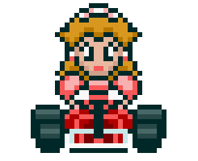

# 🏎️ Mario Kart JS

<table>
  <tr>
    <td>
      
    </td>
    <td>
      <b>Objetivo:</b>
      <p>Mario Kart é uma série de jogos de corrida desenvolvida e publicada pela Nintendo. O desafio foi criar uma lógica de um jogo de vídeo game para simular corridas de Mario Kart, levando em consideração as regras e mecânicas abaixo. Desenvolvido em JavaScript com Node.js.
			</p>
    </td>
  </tr>
</table>

---

## 📁 Estrutura do projeto
```
mario-kart-js/
├── src/
│   ├── data/
│   │   └── characters.js       # Personagens e atributos
│   ├── engine/
│   │   └── raceEngine.js       # Motor da corrida e declaração de vencedor
│   ├── utils/
│   │   ├── dice.js             # Dado, sorteio de bloco e tipo de confronto
│   │   ├── logger.js           # Funções de log
│   │   └── processBlock.js     # Processamento de RETA e CURVA
│   └── constants.js            # Constantes globais do jogo
├── index.js                    # Ponto de entrada
├── package.json
└── README.md
```

---

## 🕹️ Como rodar

**Pré-requisito:** Node.js versão 18 ou superior
```bash
# Instalar dependências
npm install

# Iniciar a corrida
npm start

# Iniciar com hot reload
npm run dev
```

---

## 👾 Personagens disponíveis

<table style="border-collapse: collapse; width: 800px; margin: 0 auto;">
  <tr>
    <td style="border: 1px solid black; text-align: center;">
      <p>Mario</p>
      
    </td>
    <td style="border: 1px solid black; text-align: center;">
      <p>Velocidade: 4</p>
      <p>Manobrabilidade: 3</p>
      <p>Poder: 3</p>
    </td>
    <td style="border: 1px solid black; text-align: center;">
      <p>Peach</p>
      
    </td>
        <td style="border: 1px solid black; text-align: center;">
          <p>Velocidade: 3</p>
          <p>Manobrabilidade: 4</p>
          <p>Poder: 2</p>
        </td>
        <td style="border: 1px solid black; text-align: center;">
          <p>Yoshi</p>
          
        </td>
        <td style="border: 1px solid black; text-align: center;">
          <p>Velocidade: 2</p>
          <p>Manobrabilidade: 4</p>
          <p>Poder: 3</p>
        </td>
      </tr>
      <tr>
        <td style="border: 1px solid black; text-align: center;">
          <p>Bowser</p>
          
        </td>
        <td style="border: 1px solid black; text-align: center;">
          <p>Velocidade: 5</p>
          <p>Manobrabilidade: 2</p>
          <p>Poder: 5</p>
        </td>
        <td style="border: 1px solid black; text-align: center;">
          <p>Luigi</p>
          
        </td>
        <td style="border: 1px solid black; text-align: center;">
          <p>Velocidade: 3</p>
          <p>Manobrabilidade: 4</p>
          <p>Poder: 4</p>
        </td>
        <td style="border: 1px solid black; text-align: center;">
        	<p>Donkey Kong</p>
          
        </td>
        <td style="border: 1px solid black; text-align: center;">
          <p>Velocidade: 2</p>
          <p>Manobrabilidade: 2</p>
          <p>Poder: 5</p>
    </td>
  </tr>
</table>

---

## 📐 Estrutura de um personagem
```js
{
  name: "Mario",
  points: 0,
  attributeLabels: {
    velocity: 4,
    maneuverability: 3,
    power: 3
  }
}
```

---

## 📋 Regras & mecânicas

### Formato da corrida
- Dois personagens disputam uma corrida de **5 rodadas**
- A cada rodada, um bloco da pista é sorteado aleatoriamente

### Blocos da pista

| Bloco | Atributo usado | Resultado |
|---|---|---|
| 🏁 RETA | Velocidade | Vencedor ganha +1 ponto |
| 🔄 CURVA | Manobrabilidade | Vencedor ganha +1 ponto |
| 🥊 CONFRONTO | Poder | Vencedor ganha turbo, perdedor perde pontos |

### Confronto
- O vencedor ganha **+1 ponto (turbo)**
- O tipo de penalidade ao perdedor é sorteado aleatoriamente:
  - 🐢 **Casco** → perdedor perde **1 ponto**
  - 💣 **Bomba** → perdedor perde **2 pontos**
- Nenhum jogador pode ter **pontuação negativa** — o mínimo é 0
- Se o perdedor estiver em 0 pontos, ele fica **protegido** e não perde pontos

### Condição de vitória
Ao final das 5 rodadas, vence quem acumulou **mais pontos**. Se ambos tiverem a mesma pontuação, a corrida termina **empatada**.

---

## 🛠️ Scripts disponíveis

| Comando | Descrição |
|---|---|
| `npm start` | Inicia a corrida |
| `npm run dev` | Inicia com hot reload via `--watch` |